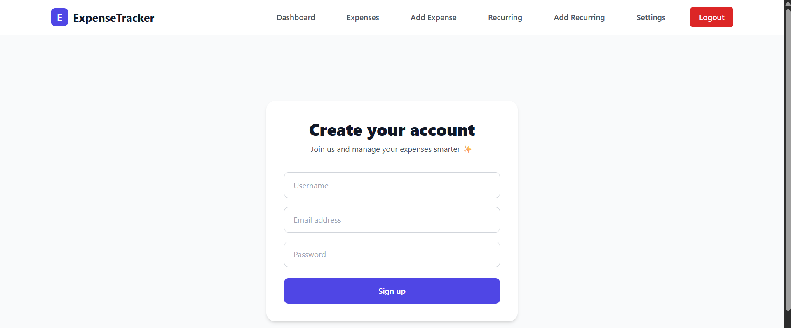
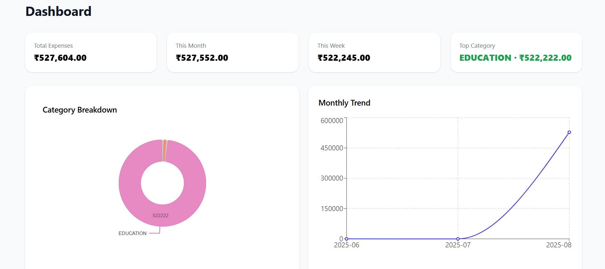
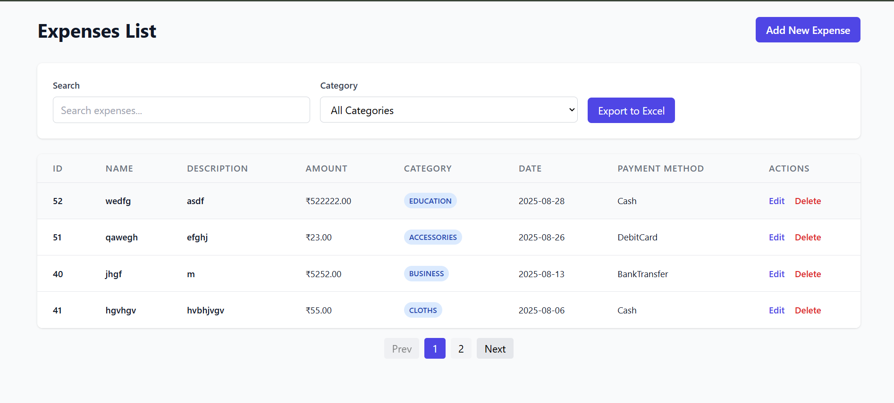
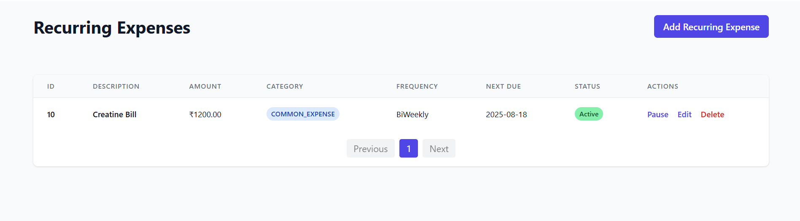
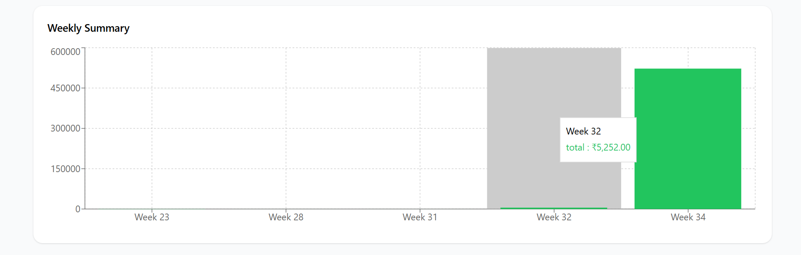

# 💰 Expense Tracker

A full-stack Expense Tracker application built with **React (frontend)** and **Spring Boot (backend)**.  
This app helps users manage daily expenses, track recurring payments, and generate reports with ease.

---

## 🚀 Features

- 🔐 **User Authentication** (Register & Login)
- 🧾 **Add, Edit, Delete Expenses**
- ♻️ **Recurring Expense Management**
- 📊 **Weekly & Monthly Reports**
- 📈 **Dashboard with Visual Insights**

---

## 🖼️ Screenshots

### 🔑 Register Page


### 📊 Dashboard


### 💵 Expenses


### 🔁 Recurring Expenses


### 📑 Weekly Report


---

## 🛠️ Tech Stack

**Frontend:** React, TailwindCSS  
**Backend:** Spring Boot, Spring Security, JPA  
**Database:** MySQL  
**Authentication:** JWT  

---

## ⚙️ Setup & Installation

### 1️⃣ Clone the repository
```bash
git clone https://github.com/your-username/expense-tracker.git
cd expense-tracker
```
### 2️⃣ Install frontend dependencies
```bash
npm install
```
### 3️⃣ Run backend (Spring Boot)
  #### please find backend code here https://github.com/lohith-jalla/Expense_Manager 
```bash
./mvnw spring-boot:run
```
### 4️⃣ Start frontend
```bash
npm start
```
### 5️⃣ Open in Browser
```bash
👉 http://localhost:5173/
```
